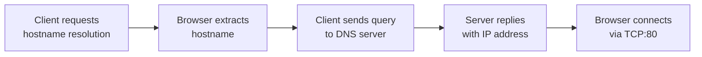

# Application Layer
**Application Architecture**: Designed by a developer to define how the application is structured across different end systems

Application Architecture is of mainly two types:
1. **Client-Server Architecture**: A paradigm where always-on host (*server*) services requests from other hosts (*clients*).
    - No direct communication amongst clients.
    - Servers have **fixed IP address** 
    - **Data Centers**: Large housing of hosts used to create powerful virtual server
2. **Peer-to-Peer (P2P)**: A paradigm with no reliance on dedicated servers; pair of intermittently connected hosts (**peers**) communicate directly with each other.
    - **self-scalable**: Peers are redistributors and consumers of bits.
3. **Hybrid Architecture**: Applications that combine both client-server and P2P elements (e.g. instant messaging using a server to track IP addresses but sending messages directly between users).

**Process** is a program that runs inside an end system.

Processes communicate with each other across the Internet via **messaging**. Sending process creates and sends *messages* while receiving process recieves and responds by sending messages back.

In P2P file sharing, the peer that downloads files is the *client*, and the peer that uploads the files is the *server*. So, the same process can be a *client* and *server* too.

In terms of a communication session, the process that *initiates* the communication is **client**, while the process waiting to be contacted is the **server**.

**Socket**: A software interface through which a process sends and receives messages from the Internet.
>Socket is interface between **applicatio layer** and **transport layer** within an end system.

>Socket is **Application Programming Interface (API)** between application and network layer.

**Addressing Processes**: To identify a recieving process, a sender must specify the **IP addredd** of the destination host and a **port number** that identifies the specific recieving process on that host.

Different services provided by *Transport Layer Protocol* to applications that invoke it include:
1. *Reliable Data Transfer: Transport Layer Protocol allows reliable data transfer with *no packet loss (due to over flowing buffer or packet being discarded owing to errors)
    - Certain *loss tolerant applications* don't mind packet loss (e.g. multimedia applications involving audio/video)
2. *Throughput*: Transport Layer Protocol would ensure that available throughput is always atleast a minimum amount requested by the application.
    - *Bandwidth-sensitive Applications*: Applications that require a minimum amount of throughput to be effective (e.g. Interent telephony)
    - *Elastic Applications*: Applicaitons that can use as much as or as little throughput as is available (e.g. e-mail, file tranfer)
3. *Timing*: Transport Layer Protocol provides timing guarantees to avoid unnatural pauses in conversations or long delays in action and required result.
4. *Security*: Transport Layer Protocol provided various security services to end systems including encryption and decryption in sending and recieving hosts.
---
## TCP Services
1. *Connection-oriented Service*: 
    - Handshaking Phase: Before application-level messages begin to flow, TCP has client and server exchange transport layer control information to alert the client and server for packet transfer.

>No encryption is provided by TCP or UDP. Data passes through un-encrypted thus allowing potential sniffing or intervention at different links between sender and reciever.

>*Secure Socket Layers (SSL)* is a TCP enhancement that provides process-to-process security like encryption and end-point authentication while providing usual TCP services as well.
>>When applications use SSL, cleartext is is sent to SSL socket; SSL encrypts the data and sends it to TCP socket. This data travel via the Internet to the socket of recieving end system, where SSL decrypts the data.

2. *Reliable Data Transfer Service*: TCP guarantees for same stream of bytes to reach receiving socket as it left the sending socket.
3. *Congestion Control Mechanism*: Throttles sending prcoess when network is congested and limits each TCP to specified bandwidth.

## UDP Services
- *Connectionless* so no handshake before two processes start communicating.
- No guarantee that messages will reach receiving process, if in order.
- No congestion control mechanism

|Application|Application-Layer Protocol|Underlying Transport Protocol|
|---------|-----------------------|----------------|
|Electronic Mail|SMPT|TCP|
|Remote Terminal Access|Telnet|TCP|
|Web|HTTP|TCP|
|File Tranfer|FTP|TCP|
|Streaming Multimedia|HTTP|TCP|
|Internet Telephony|SIP|UDP or TCP|

>Internet Telephony applications can often cope with some loss but require minimal rate, UDP is sometimes prefered over TCP.
>>Most firewalls are configured to block most UDP, Internet Telephony applications often designed to use TCP as backup.

## Application Layer Protocols
*Application Layer Protocols* define *type, **syntax, **meaning of information in fields* and *rules* of messages sent among application processes running on different end-systems.

Applicaition Layer Protocol is piece of network application.
- *Web* is client-server application allowing users to obtain documents from Web servers by usinf *HTTP*, Web's application-layer protocol which defines the format and sequence of messages exchanged between browser and Web server.
- *e-mail* application has many componenets, of which *SMTP* is its main application layer protocol.
---
## The Web and HTTP
**Web Pages**: Collections of *objects*, such as HTML files, JPEG images or video clips.

*Object*: File that is addressable by single **URL**

**Uniform Resource Locator(URL)**: Consists of two components, hostname of the server hosting the object and the object's pathname

**Hyper Text Transfer Protocol(HTTP)**: Web's application-layer protocol that defines how clients request Web pages and how servers transfer them.

>Web browsers implement client side of HTTP.

>Web servers implement server side of HTTP.

**Stateless Protocol**: HTTP is considered stateless because the server maintains **no information** about the clients; if a client requests the same object twice, the server simply sends it again.

## Non-Persistent and Persistent Connections
1. **Non-Persistent Connections**: A mode where each request/response pair is sent over a **seperate TCP connection**.
    - Connection does not persist for other objects
    - Each TCP connection transports one request and one response message before terminating the TCP connection
    - Multiple TCP connections are made for request and response of each object

**Round-Trip Time(RTT)**: Tome takes for packet to go from client to server and back to client.
- Includes packet-propagation delays, queuing delays and packet-processing delays.

**Three-Way Handshake**: The process of establishinh a TCP connection, which takes one RTT before the actual request is sent.
>Three-Way Handshake: 
```
1. Client sends a TCP segment to the server  

2. Server acknowledges and responds with TCP segment

3. Client acknowledges back to server
```
>1 RTT - first two steps of the handshake. 2nd RTT - after the handshake, server sends the HTML file into TCP connection.

2. **Persistent Connections**: Mode where all requests and responses are sent over **same TCP connection**.
    - Server leaves TCP connection open after sending a response

>By default, HTTP uses persistent connections, but can be configured to use non-persistent connections.

## HTTP Request Message Structure
>HTTP uses **TCP** as underlying protocl, ensuring messages arrive intact.

HTTP messages are written in ordinary **ASCII text** and a fixed structure for request and response.

1. **HTTP Request Message Structure**
    - **Request Line**: Top line in structure; has 3 fields:
        - **Method**: **GET** (requests objects), **POST** (sends data like form inputs), **HEAD** (requests only headers, leaving out objects), **PUT** (uploads files) and **DELETE**
        - **URL (uniform resource locator)**: The path to the specific object being requested
        - **Version**: The specific protocl version the cliet is using (e.g. HTTP)
    - **Header Lines**: Provide metadata about the request; e.g:
        - `Host`: Specifies the server address where object resides
        - `User-agent`: Identifies the browser type (e.g. Chrome) making the request
        - `Connection`: The user's preferred language (e.g. English)
        - `Accept-language`: The user's preferred language (e.g. English)
    - **Blank Line**: A mandatory empty line (marked by a carriage return and line feed) seperating the headers from the body
    - **Entity Body**: This section is empty for GET requests but contains data (like form field values) for POST request.
2. **HTTP Response Message Structure**
    - **Status Line**: Top line in structure; contains **Protocol Version** , **Status Code** and **Status Message**
        - **Common Status Code**:
            - `200 OK`: The request succeeded and object is returned 
            - `301 Moved Permanently`: The object has a new URL
            - `404 Not Found`: The requested document does not exist on the server
            - `505 HTTP Version Not Supported`:The server doesn't support the requested version
    - **Header Lines**: Metadata about the server and the returned object
        - `Date`: When the response was created
        - `Source`: The type of server software (e.g. Apache)
        - `Last-modified`: When the object was last changed (crucial for Web caching)
        - `Content-Length`: The size of the object in bytes
        - `Content-Type`: The type of object in the body (e.g. text/html)
    - **Blank Line**: Seperates the header lines from the data
    - **Entity Line**: Bottom line; contains **requested data** (e.g. HTML code or image or audio file)
---
## Cookies: User-Server Interaction
**Cookies**: A techonology that allows websites to *identify users* and *track* their activites (since HTTP is **stateless** protocol)

1. **A cookie header line** in HTTP **response** message (e.g. `Set-cookie: 1678`)
2. **A cookie header line** in the HTTP **request** message (e.g. `Cookie: 1678`)
3. **A cookie file** kept on user's end system and managed by user's browser
4. **A back-end database** at the web site to store user-specific information

How cookies work:
1. When user visits a site for the first time, server creates **unique identification number** along with an entry in its back-end database using that number
2. Server responds to browser with a message containing `Set-cookie:` header and unique ID
3. Browser then makes a line in local cookie file including **server's hostname** and the ID
4. When user visits the site again and requests a page, browser automatically extracts the ID from cookie file and includes it in the `Cookie:` header in HTTP request.
5. Server receives the ID and tracks the pages, at what time and their exact order the user visited 

Cookies are used in:
- **online shopping carts** to keep track of all items, allowing a collective purchase at the end of the session
- **personalizing requests**, based on the pages viewed by user before
- **associating name, password, card details to cookie ID**, thus not requiring to re-enter information.

>By combining cookies with user-supplied information like name, e-mail, card details, a complete user profile can be made and be sold to third parties as well.
---
## Web Caching
**Web Cache / Proxy Server**: A network that tries to satisfy HTTP requests on behalf of the origin server.

>Cache is server for the browser (sends request and recieves response from browser) and client for the origin server (sends request to and recieves response from orign server).

How it works:
1. **Request Redirection**: The browser establishes a TCP connection to the Web cache and sends HTTP request there
2. **Checking**
    - If cache has local copy of requested object, it returns it within an HTTP response
    - If cache has no local copy of requested object, as a client, establishes a seperate TCP connection with origin server
3. After recieving object from origin server, cache stores a copy in local storage and forwards a copy to browser

A web cache
- **reduces response time** for requests
- **reduce traffic** on access links bought by *local ISP* or *institutions*

**Hit Rate**: The fraction of requests satisfied directly by a cache

**CDNs (Content Distribution Networks)**: Companies that install many geographically distributed caches to localize traffic

## The Conditional GET
**Conditional GET**: A mechanism that allows a cache to verify if locally copied object has any modifications in the origin server

- **The Request**: The cache sends a request to the origin server including `If-Modified-Since:` header containing the date object was last cached.
- **The Response**: 
    - If object has **not** been modified since, server returns **304 Not Modified** response
    - If object **has** been modifed, server returns updated version in "200 OK" response
---
## File Transfer: FTP
HTTP and FTP are both file transfer protocols of the application layer.

>Both run on TCP, however FTP has unique architectural approach.

### Overview of FTP
- Allows a user to transfer files to or from a remote account
- **Authentication**: Requires user to provide a **user identification and password** to access the remote account
- **User Interface**: The user interacts with FTP though an 
**FTP user agent**, which communicates with the remote FTP server

### The two-Connection Architecture
FTP's unique architectural structure is **two parallel TCP connections** used to transfer a single file
1. **Control Connection (Port 21)**: Used for sending *control information* like user ID, passwords and commands to change directories or *put* (store) and *get* (retrieve) files
    - >Persistent (single Control Connection remains open for entirity of user's session)
2. **Data Connection (Port 20)**: Used specifically for the actual transfer of file data
    - >Non-Persistent (one Data Connection is for one file transferred within a session)

**Out-of-Band Signaling**: FTP uses seperate connection for control information, it sends control information **out-of-band**

**In-Band Signaling**: HTTP sends request and response headers in the same TCP connection used for file data, making it signal **in-band**.

**Statefulness**: FTP servers **maintain state** about the user by *tracking* user's current directory and previous authentication

### FTP Commands 
FTP commands are from *client to server*; written in **7-bit ASCII** format; *4 uppercase ASCII characters* with *optional arguments*; `[]` means optional
- `USER [username]`: Sends the user ID to server
- `PASS [password]`: Sends the user password
- `LIST`: Asks the server to send back a list of all files in the current remote directory (this list is sent ovver a *data connection*)
- `RETR [filename]`: Used to retrieve (download) a file
- `STOR [filename]`: Used to store (upload) a file to the remote host
### FTP Replies
FTP replies are from *server to client*; each command get a reply; *3-digit number* with *optional message*
- `331` Username OK, password required
- `125` Data Connection already open; transfer starting
- `425` Can't open data connnection
- `452` error writing file
---
## Simple Mail Transfer Protocol: SMTP
Electronic mail has 3 main components:
1. **User Agents**: These allow users to *read*, *reply*, *forward* and *compose* messages (e.g. Microsoft Outlook, Apple Mail or web-based interfaces like Gmail)

2. **Mail Services**: Manages an **outgoing message queue** for mail being sent
    - core of e-mail infrastructure
    - each recipient has **mailbox**

3. **SMPT**: Uses reliable data transfer to transfer mail from sender's mail server to recipient's server
    - Runs on both client and reciever server

### SMTP: The PUSH Protocol
SMPT defines how mail servers speak to each other to transfer messages

**The Process**: Invloces a three-phase transfer: **Handshaking, Transfer of messages** and **Closure**

**Push Protocol**: SMPT is primarily a **push protocol**, the sending mail server initiates the connection to "push" the file to the reciever.

**Direct Transfer**: Unlike some other protocols, SMPT does not use intermediate mail servers; the connection is a direct TCP link between the sender's and recipient's servers

**ASCII Command/Reply**: SMPT uses 7-bit ASCII for its commands (e.g. `Hello`, `MAIL FROM`, `RCPT TO`, `DATE`, `QUIT`) and status replies (e.g. `250 OK`, `354 Intermediate response`)

### SMTP vs HTTP
Both protocols transfer files over TCP, but
|HTTP|SMTP|
|----|----|
|**Pull Protocol**: Client sends request for pages already uploaded onto the server|**Push Protocol**: Sending mail server pushes file to recieving mail server|
|TCP connection made by machine wanting to *recieve* the file |TCP connection initiated by machine wanting to *send* the file|
|HTTP has no constrictoin|SMTP requires only **7-bit ASCII** format|
|HTTP encapsulates each object in own response message|SMPT places all of message's objects into a single **single message**|

### Mail Merge Format and Access Protocols
**Mail Merge Format**: Format of actual message inside SMTP envelope; includes **header lines** (e.g. `To:`, `From:`, `Subject:`) followed by **message body** seperated by a blank line

**Mail Access Protocols**: Because SMTP is a *push* protocol, it can't be user agent to "pull" messages from a server. Specific protocols include:
1. **POP3 (Post Office Protocol - Version 3)**: A simple "pull" protocol.
    - Operates in **download-and-delete** or **download-and-keep** modes
    - It is **stateless**
2. **IMAP (Internet Mail Access Protocol)**: Allows user to create folders on servers and organize messages (move messages, delete messages etc)
    - It **maintains state** accross sessions
    - Allows user to obtain **part of the message** sent. When a low-bandwidth connection is there between user agent and mail server, viewing the contents instead of the attached file (which would take time to download) conveys the message as well
3. **HTTP**: Users using web-based email(Gmail, Yahoo Mail) have user agents as web browser and the transfer between the browser and the mail server happens via **HTTP**
---
## DNS (Domain Name System)
- DNS, the Internet's *directory service* is the *distributed database* and *protocol* used to translate human-friendly hostnames into the IP addresses that network routers require to identify and locate end systems.

### Services Provided by DNS

> DNS is an *application-layer* protocol that runs over **UDP** on **port 53** (falling back to TCP for larger responses).

- **Hostname-to-IP-Address Translation**: Lets application-layer protocols like HTTP, SMTP, and FTP resolve a hostname (e.g. `www.example.com`) to the 32-bit IP address needed to open a connection.
    - **IP address**: a 32-bit number consisting of 4 bytes separated by `.`, each byte ranging from 0 to 255.
    - Resolution flow:

- **Host Aliasing**: A host can have one **canonical hostname** and one or more **alias names** that are typically easier to remember.
- **Mail Server Aliasing**: DNS lets a company's mail server and web server share the same alias (e.g. both reachable via `enterprise.com`), even though each maps to a different canonical hostname behind the scenes.
- **Load Distribution**: For a site replicated across multiple servers, DNS maps one canonical hostname to a *set* of IP addresses, rotating their order in each reply to spread traffic across the replicas.
---
### How DNS works
DNS is **distributed, hierarchial database** because a single, centralized server would not scale to the size of the modern Internet.
- **The Hierarchy**:
    1. **DNS Recursor (Resolver)**: Recieves intial query from web browser; tracks IP address; caches answers for quick responses in the future; thus is like librarian for computer
    - **Root DNS Servers**: There are 13 root servers (clusters of replicated servers) that provide the IP addresses of TLD servers
    - **Top-Level Domain (TLD) Servers**: These are responsible for generic domains like `.com`, `.org`, `.edu` and country domains like `.uk` and `.fr`.
    - **Authoritative DNS Servers**: These house the actual DNS records that contain an organization's hostname to IP addresses
- **Local DNS Servers**: While not strictly part of the hierarchy, these act as proxy for hosts (provided by ISPs), forwarding the queries into the hierarchy to resolve addresses
- **Query Types**: Queries can be **recursive** (client requests server to find the answer itself) or **iterative** (the server returns the address (as a referral) of the next server in the chain for the client to contact rather than giving final answer)
- **DNS Caching**: To improve performance and reduce traffic, DNS servers cache mappings they recieve; these are usually discarded after couple of days

>**DNS Poisoning**: A security attack where an attacker sends bogus records to a DNS server to trick into caching false information.
---
### DNS Records and Messages
The database stores **Resource Records (RRs)** (basic unit of information), which are four-tuples containing: `(Name, Value, Type, TTL)`.
- **Type A**: Name is a hostname, Value is its IP address
- **Type NS**: Name is a domain, Value is the hostname of an authoritative server for that domain
- **Type CNAME**: Name is an alias, Valuse is the canonical hostname
**Type MX**: Name is an alias, Value is the canonical name of a mail server

DNS messages (*queries and replies*) share a unified format consisting of header, a question section, an answer section, an authority section, and an additional informaiton section


